# 3.4.1 / 3.3.2
## Использован пандас, запускается с concurrent.features для каждого года. Из столбца с датой берется год, минимальный и максимальный месяц. Для каждого месяца делается запрос к api на получение курса валют. 100 строк не вмещаются в скрин
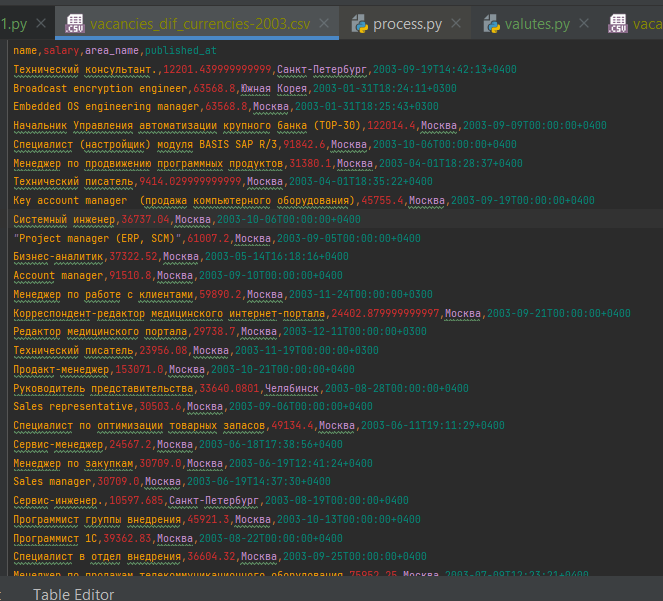

# 3.3.1
## 
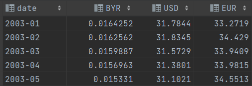

# 3.2.3
## concurrent.futures оказался быстрее
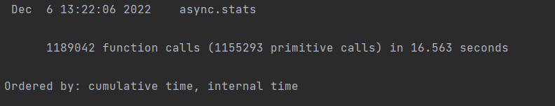
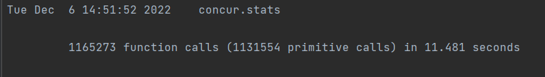

# 3.2.2
## С использованием многопроцессорности время обработки файла 109mb сократилось примерно в 4 раза
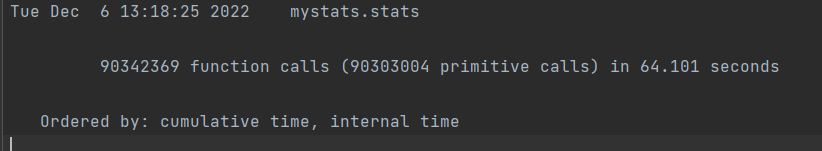

# 3.2.1
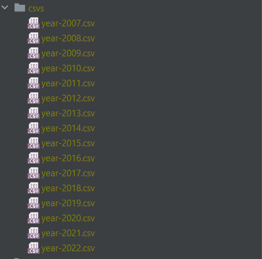

# 2.3.2
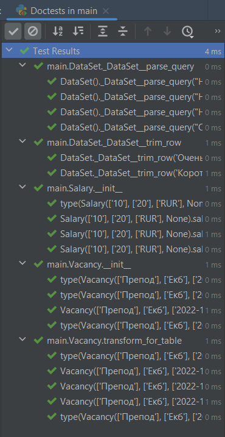
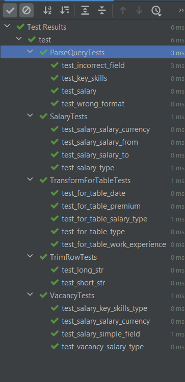

# 2.3.3
## Найден метод, скорость работы которого можно увеличить на треть. Это метод удаления html тегов и нормализации пробелов в строке. Приведены три варианта исправления.
### Изначальная функция через strptime:
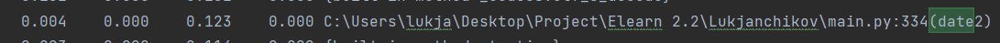
### Функция через ручной парсинг даты, в 4 раза быстрее:

### Самая быстрая функция, быстрее в 100+ раз. Оказалось, что формат даты в csv файлах позволяет сортировать даты как строки:
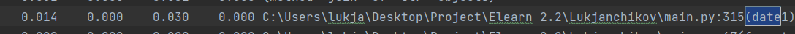
### Код функций:
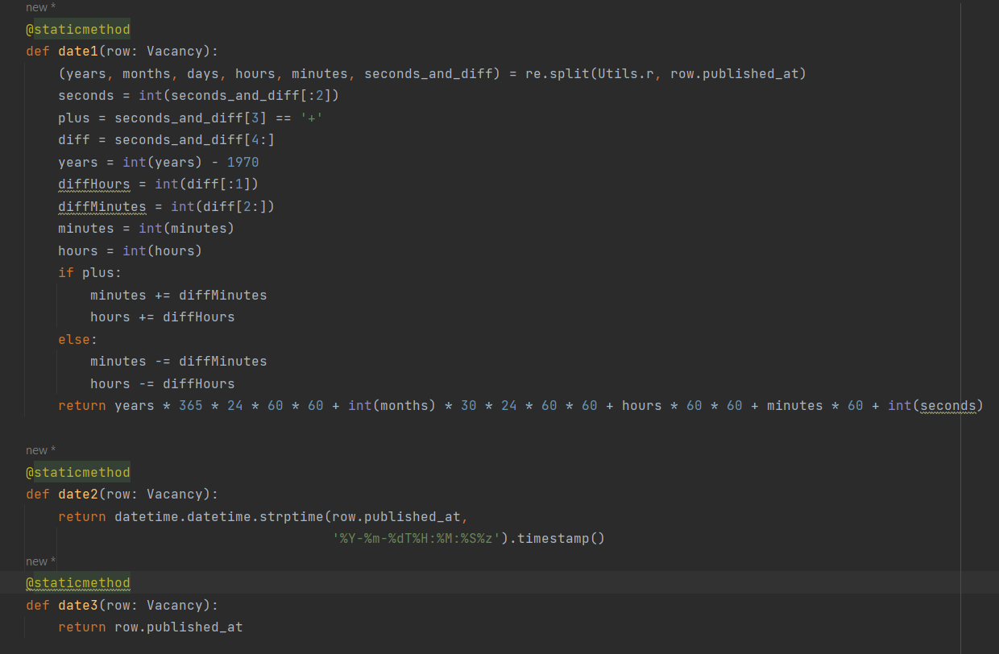
