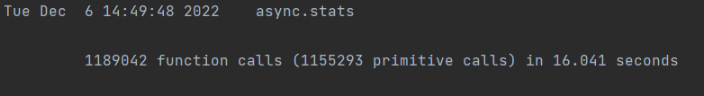
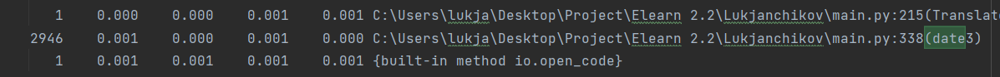

# 3.5.2
## В файле [3.5.2.py](3.5.2.py) с помощью pandas и sqlite3 обработан файл с вакансиями с учетом курсов валют из бд. Результат сохранен в бд в таблицу VACANCY. БД стала слишком тяжелой, гит не позволяет ее загрузить.

# 3.5.1
## В файле [3.5.1.py](3.5.1.py) с помощью модуля sqlite3 и метода pandas.to_sql создана бд [proj.db](proj.db), таблица VALUTES и в нее помещены данные по курсам валют

# 3.4.3
## С помощью пандас переписан функционал формирования статистики по городам. Также дописан функционал выбора професии и города, по которым статистика считается за каждый год. Файлы: [3.4.3_pd_city_stat.py](3.4.3_pd_city_stat.py), [city_report.pdf](city_report.pdf)

# 3.4.2
## С помощью пандас переписан функционал формирования статистика по годам и создания изображения графиков и pdf. Файлы: [3.4.2_pd_stat.py](3.4.2_pd_stat.py), [year_report.pdf](year_report.pdf), year_graph.png

# 3.4.1 / 3.3.2
## Использован пандас, запускается с concurrent.features для каждого года. Из столбца с датой берется год, минимальный и максимальный месяц. Для каждого месяца делается запрос к api на получение курса валют. 100 строк не вмещаются в скрин

# 3.3.3
## В файле 3.3.3_hh.py делаются запросы по api к hh.ru для получения вакансий на 21\12\2022. Запрос делится на двухчасовые промежутки и каждый промежуток на страницы. Итоговый результат сохранен в файл hh.csv

# 3.3.1
## Файл valutes_percentage.csv. С помощью pandas вычислено количество повторений каждой валюты и посчитаны доли каждой валюты, у которой более 5000 вхождений.
## Файл 3.3.1_dataframe.csv. С помощью пандас и api высчитаны по каждому месяцу курсы валют, которых больше 5000, если они есть.

# 3.2.3
## concurrent.futures оказался быстрее

# 3.2.2
## С использованием многопроцессорности время обработки файла 109mb сократилось примерно в 4 раза

# 3.2.1

# 2.3.2

# 2.3.3
## Найден метод, скорость работы которого можно увеличить на треть. Это метод удаления html тегов и нормализации пробелов в строке. Приведены три варианта исправления.
### Изначальная функция через strptime:

### Функция через ручной парсинг даты, в 4 раза быстрее:

### Самая быстрая функция, быстрее в 100+ раз. Оказалось, что формат даты в csv файлах позволяет сортировать даты как строки:

### Код функций:

